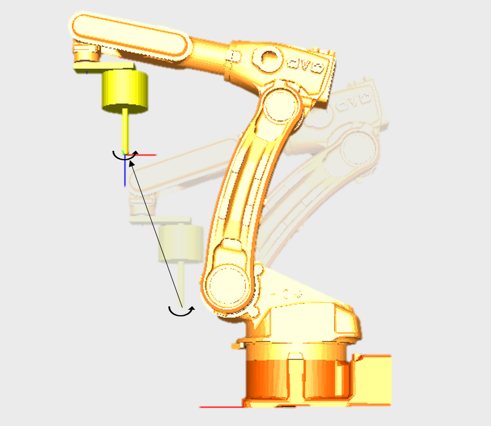

# 1. 개요


V60.26-00 부터 지원됩니다.


본 기능은 로봇의 R1 축 또는 JIG축으로 설정된 부가축에 대해서 소프트리밋을 초과하는 회전이 가능하도록 하는 기능입니다. 이 기능은 크게 세가지 용도로 사용할 수 있습니다. 

첫째는 로봇 JOB 프로그램에서 지정된 스텝의 위치를 기준으로하여 회전수를 지정하는 방법입니다. JOB 프로그램 상단에 회전량을 설정하고 구동하면 그 횟수만큼만 축이 회전하는 JOB 프로그램을 만들 수 있습니다. 

두 번째로 ± 180 deg를 초과한 엔드리스 회전축을 ± 180 deg 이내의 회전각으로 환산하는 기능입니다. 예를 들어 360 deg 회전되어 있는 축은 물리적으로 0 deg와 동일합니다. 이때 엔드리스 리셋 기능은 축을 0 deg 위치로 이동시킬 때 역회전을 시키지 않는 편리한 기능입니다.

마지막으로 엔드리스 회전축을 0 deg로 설정하는 기능입니다. 이 엔드리스 제로 기능은 엔드리스 회전 축의 절대 위치는 상관 없이 현재 위치를 0 deg로 설정하고자 할 때 사용하는 기능입니다. 따라서 엔드리스 리셋 기능과 유사하나 물리적인 축의 절대 위치는 유지하지 않고 현재의 위치를 0으로 변경합니다.

- 기능의 특징 

    (1) 엔드리스 회전수의 간편한 지정(전용함수 지원)  
    (2) R1축 엔드리스 회전시 직선 보간지원(단, 툴의 X,Y방향은 내부적으로 0으로 설정됨) 
    (3) 소프트리밋을 범위를 벗어나는 범위의 회전이 가능 
    (4) 스텝도달시, 정지시의 자동 리셋기능 
    (5) 1회전 이내의 각도로 변환하는 엔드리스 리셋 전용 함수 제공 

