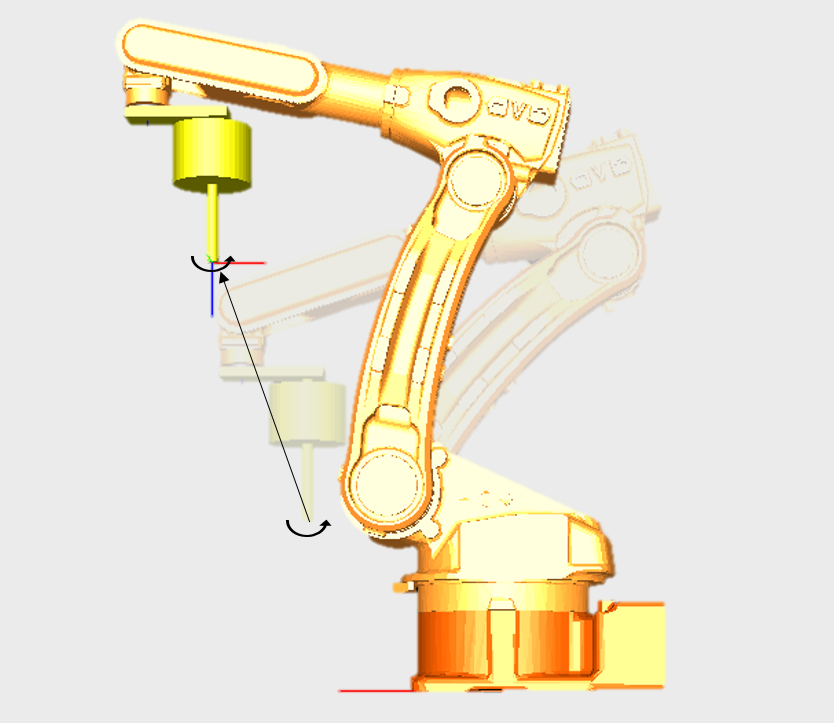

# 1. Overview


Supported from V60.26-00.


This function allows an axis configured as an R1 axis or a jig axis to rotate beyond the software soft-limit. It has three main uses:

1. Specify a number of rotations relative to a position in a robot JOB program. By setting the rotation count and running it, the specified axis will rotate the exact number of turns.

2. Convert an endless axis that has rotated beyond ±180° into an equivalent angle within ±180°. For example, an axis rotated to 360° is physically equivalent to 0°. The endless reset function is convenient because it avoids reverse rotation when moving the axis to the 0° position.

3. Set the endless rotation axis to 0°. The endless zero function sets the current position to 0° regardless of the axis's absolute position. It is similar to endless reset function. However, instead of preserving the physical axis's absolute position, it changes the current position to zero.

- Features

    (1) Easy specification of endless rotation count (dedicated function supported)
    (2) Linear interpolation support when R1 axis performs endless rotation (tool X/Y internally set to 0)
    (3) Rotation beyond soft-limit range allowed
    (4) Automatic reset when step is reached or on stop
    (5) Dedicated reset function to convert to an angle within one revolution

