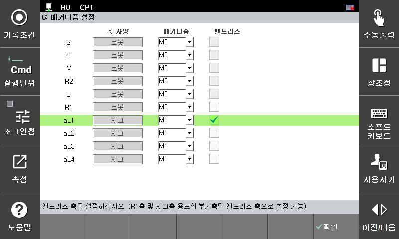

# 2.1 환경 설정

1.	[**시스템 > 초기화 > 메커니즘 설정**]메뉴에서 엔드리스 축을 설정합니다. 엔드리스 축으로 사용하고자 하는 축을 엔드리스 '유효'로 설정을 변경합니다. 엔드리스 축은 축 사양에 따라 선택이 가능하지 않을 수 있습니다. 

2.	축 사양이 '로봇'인 경우 'R1'축이 엔드리스 축으로 설정이 가능하고, 부가축인 경우 축 사양이 '지그' 또는 '포지셔너'일 때 엔드리스를 유효로 설정할 수 있습니다.

3.	설정이 완료되었으면 완료 키를 누릅니다.

4.	제어기를 재부팅하면 엔드리스 축 설정이 적용됩니다.

 

 
1.	본 기능은 제어기를 재부팅할 때 엔드리스 축에 대해서 -180~180deg로 자동 환산하여 축의 위치를 변경합니다.
2.	백업된 프로젝트 파일로 제어기를 복구하고자 할 때에는 엔드리스 축의 물리적인 위치는 복구할 수 없으므로, 엔코더 옵셋 및 축정수 위치를 다시 설정하여 주십시오.


