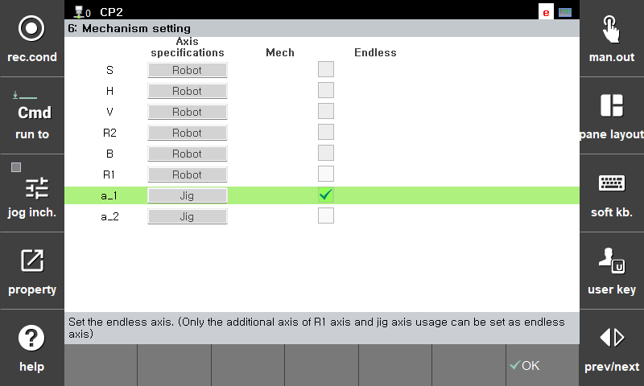

# 2. System Settings

1. In [**System > Initialize > Mechanism Settings**], configure the endless axis. Check the axis to enable it for endless operation. Note that not all axes can be set as endless depending on axis specifications.

2. If the axis type is "Robot", the R1 axis can be set as an endless axis. For additional axes, set endless to enabled when the axis type is "Jig" or "Positioner".

3. After completing settings, press the OK key. 

4. Reboot the controller to apply the endless axis setting.

 


1. When the controller reboots, the endless axis positions are automatically converted to values within -180~180°.
2. If you restore the controller from a backed-up project file, the physical positions of endless axes cannot be restored. Reconfigure the encoder offsets and axis calibration values.


